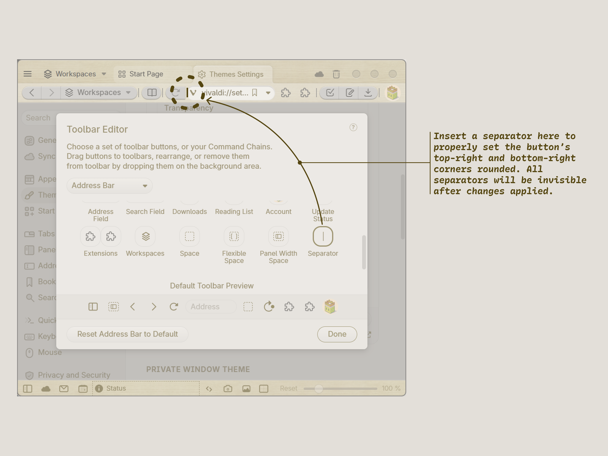

# Muku for Vivaldi

A Vivaldi theme heavily hacked with custom CSS, paying tribute to the classic Muku theme, originally created by [Daisuke Yamashita](https://web.archive.org/web/20061016181031/http://homepage.mac.com/dsky/guikit.html).

The theme has been limitedly tested on Vivaldi 6.9.3447.46 / Windows 11 Version 23H2. Future updates of Vivaldi may break the theme.

Also, the “hacked” scope of the UI is currently highly opinionated, e.g. tab positions other than “Top” are not tested. The theme may not behave optimally in your preferred Vivaldi configurations.

*Use at your own discretion.*

## Instructions

1. Clone or download this repo.

2. Enable Vivaldi’s Custom UI Modification feature following [this guideline](https://forum.vivaldi.net/topic/37802/css-modifications-experimental-feature).

3. Then, in Vivaldi’s Appearance settings (`vivaldi://settings/appearance/`), select the `styles` folder.

4. Restart Vivaldi. Then in Vivaldi’s Themes settings (`vivaldi://settings/themes/`), import `theme/Muku.zip`. You may customize settings such as Corner Rounding in the theme editor.

5. For the button rounded corners to appear properly, right-click on the toolbar, and select Customize Toolbar. Place a separator after each group of buttons. Separators will only be visible in the toolbar customization mode. See the figure below.

## Miscellaneous Notes

The “default” font used is [Inter](https://rsms.me/inter/) with a few [character variations](https://developer.mozilla.org/en-US/docs/Web/CSS/font-feature-settings) turned on[^1]. You may modify`styles/typography.css` to your liking, or delete it.

[^1]: The result happens to be very similar to the [customized Inter introduced in Blender 4.0](https://projects.blender.org/blender/blender/pulls/119720)